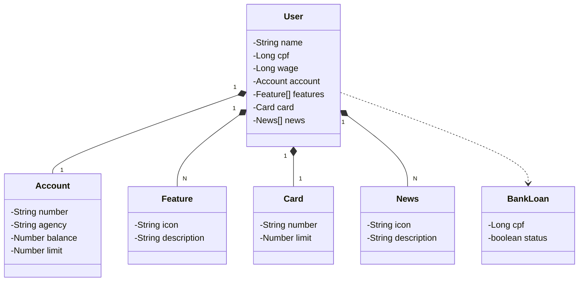

# Santander_dev

<h1> This project was created and thinking about a DIO course </h1>

<h2> Proposal </h2>

 The purpose of this project is to simulate a banking application where it is possible to register users with salary, CPF and name with classes linked to it such as: account, card, features, news, bank loan and account. 

<h2> Technologies Used </h2>

<ol>
<li>Java 17</li>
<li>Spring Boot 3.2</li>
<li>Swagger (To document and facilitate access to endpoints)</li>
<li>Railway</li>
<li>PostgreSQL</li>
</ol>

 This project was designed to run in production with Railway with a PostgreSQL cloud server.  

<h1> Class Diagram </h1>

